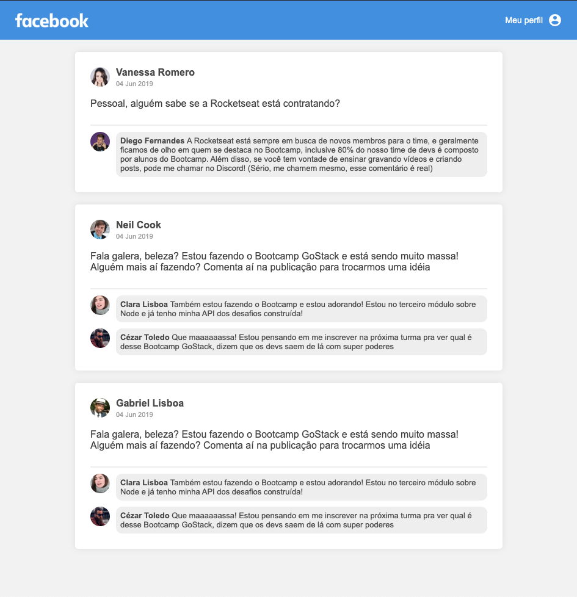

# Desafio 04: Introdução ao ReactJS

<h1 align="center">
    
</h1>

## About

A simple copy of facebook

## Installation

Clone the project with

```sh
git clone https://github.com/cadohr/rocketseat-bootcamp-desafio04.git
```

Get in the project path

```sh
cd rocketseat-bootcamp-desafio04
```

Then install the dependencies with:

```sh
yarn
```

Start application with:

```sh
yarn dev
```

## Screenshot


